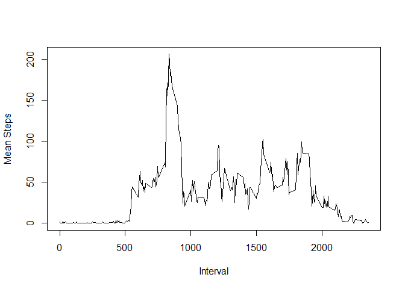

# Reproducible Research - Peer Assessment 1
Nagapriya  
January 10, 2017  
Finding Patterns in Activity Monitoring Data
==========================================================

## Loading and preprocessing the data

Reading the dataset into a dataframe called "activity"


```r
activity<-read.csv("activity.csv",header=TRUE)
```

## What is mean total number of steps taken per day?

Finding the total number of steps taken each day. Note that the NA values are left as they are.


```r
totalbydate<-aggregate(activity$steps,by=list(date=activity$date),FUN=sum)
colnames(totalbydate)[2]<-"totalsteps"
```

Calculating the histogram of the total number of steps taken each day:


```r
with(totalbydate,hist(totalsteps))
```

<!-- -->

The mean and median of the toal number of steps taken each day are calculated using the following code:

```r
mean(totalbydate$totalsteps,na.rm=TRUE)
median(totalbydate$totalsteps,na.rm=TRUE)
```

The mean and median of the total number of steps taken each day is 1.0766189\times 10^{4} and 10765 respectively.


## What is the average daily activity pattern?


The average daily activity pattern (average number of steps for every time interval on all days) is calculated using the following code:


```r
library(dplyr)
```

```
## 
## Attaching package: 'dplyr'
```

```
## The following objects are masked from 'package:stats':
## 
##     filter, lag
```

```
## The following objects are masked from 'package:base':
## 
##     intersect, setdiff, setequal, union
```

```r
by_interval<-group_by(activity,interval)
avgbyinterval<-summarise(by_interval,mean(steps,na.rm=TRUE))
colnames(avgbyinterval)[2]<-"meansteps"
```

Timeseries plot of the mean number of steps for a given time interval

```r
with(avgbyinterval, plot(interval,meansteps,type="l",xlab="Interval",ylab="Mean Steps"))
```

<!-- -->

The interval which has the maximum number of mean steps is calculated using


```r
maxstepinterval<-avgbyinterval[which(avgbyinterval[2]==max(avgbyinterval[2])),1]
```

The interval which has the maximum number of mean steps is 835.


## Imputing missing values

The total number of missing values in the dataset is 2304. This was calculated using the code


```r
sum(is.na(activity$steps))
```

Missing values are imputed using the mean for that 5 minute interval. The following code creates a new dataset called activity_imputed. This new dataset is the same as the "activity" dataset, but has the missing values fillen in using the mean of the stepa for that 5 minute interval.


```r
activity_imputed<-activity %>% group_by(interval) %>% mutate(steps = replace(steps, is.na(steps), mean(steps, na.rm=TRUE)))
```

Calculating the the total number of steps taken each day for the new (with imputed missing data) dataset and plooting its histogram:


```r
totalbydate_imputed<-aggregate(activity_imputed$steps,by=list(date=activity_imputed$date),FUN=sum)
colnames(totalbydate_imputed)[2]<-"totalsteps"
with(totalbydate_imputed,hist(totalsteps))
```

<!-- -->

The mean and median of the total number of steps taken each day are calculated for the imputed dataset using the following code:

```r
mean(totalbydate_imputed$totalsteps,na.rm=TRUE)
median(totalbydate_imputed$totalsteps,na.rm=TRUE)
```

The mean and median of the total number of steps taken each day for the imputed dataset are 1.0766189\times 10^{4} and 
1.0766189\times 10^{4} respectively.

**The effect of imputing using mean values: Imputing using mean values does not affect the mean number of steps. The median of the dataset underwent a small change.**

## Are there differences in activity patterns between weekdays and weekends?

Creating a new factor variable "weekfactor" to indicate whether a date is a weekday or a weekend day


```r
weekends<-c('Saturday','Sunday')
activity_imputed$weekfactor<-factor(weekdays(as.Date(activity_imputed$date)) %in% weekends,levels=c(FALSE,TRUE),labels=c("weekday","weekend"))
```

Aggregating data by interval and by weekfactor and making a plot to compare activity on weekdays and weekend days.


```r
avgbyint_imp<-aggregate(activity_imputed$steps,by=list(interval=activity_imputed$interval,weekfactor=activity_imputed$weekfactor),FUN=mean)
library(lattice)
xyplot(x ~ interval |weekfactor, data=avgbyint_imp, type='l', layout = c(1,2),ylab="mean steps taken")
```

<!-- -->

